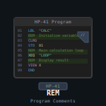

# hp-41_rem

 

##HP-41: REMembering (event manager)

**NOTE:** This program is part of the ISENE.ROM (https://github.com/isene/hp-41_isene-rom). The FOCAL listing can be found in the "src" folder of that project. Any updates and new version will be found there.

Now your HP-41 can truly come to everyday use. With this program you can convert your calculator to a PDA.

Move beyond the 10 alarms limit of the calculator. Let your calculator take care of remembering and keeping track of appointments. Some of the features include:

* Very easily enter new appointments
* List all appointments. If you have a printer, let it print them out
* Quickly edit appointments
* Show today’s events

Here is the key mapping (what shows in the programs menu is in parenthesis):

Label (Menu)	|Description
----------------|-----------
REM	|Starts the REMembering program. Shows some of the mapping for the top keys so that you don’t have to remember this list. Pressing R/S will give you the version number of REM, another R/S will get you back to the mapping/menu..
R+	|Enter the date of the event. Enter the time of the event. In the alpha register, enter the message (up to 12 characters). Then XEQ "R+". This is a global label so that you can assign it to a key for easy entry of new appointments.
LBL A (+)	|Same as R+ above, but used inside the program.
LBL a (-)	|Delete the current record.
LBL B (L)	|List all appointments. The appointments will be shown the way you enter new events, i.e. the alpha content will be active for each appointment shown, with the time in the X-register and the date in the Y-register. If you have a printer attatched, it will print out all the appointments in the storage format (the format used in the extended memory file "R" is "MM,DD:HH,MM:EVENTMESSAGE").
LBL b (E)	|Edit the current record (calls ED).
LBL C (?)	|Search the event file for string in alpha register.
LBL D (T)	|Show the events of today (simply calls ALMCAT).
LBL d (S)	|Forces a sort of the event file ("R") so that the events are in proper date/time order. This function is available because new events are added in the beginning of the file and this may not be where it should appear if sorted correctly.
LBL E (\*)	|Go back to the menu.
LBL e	Initiates the program (sets up the alarm calling ^^R – se below for technical info).

Technical notes: This program needs an HP-41CX or the equivalent. It also needs an ascii file called "R" to store the events. It further needs the programs "FLSORT" and "FLSZ+" to function. These programs are contained in the package [hp-41_notes](https://github.com/isene/hp-41_notes).

The program will store the events in the format "MM,DD:HH,MM:EVENTMESSAGE" regardless of the date format you use on your calculator (MM,DDYYYY or DD,MMYYYY). This is done for sorting convenience.

When the program is initiated (via LBL e), it sets up an alarm that executes "R" every night. This is where the magic happens. "R" will go through the extended memory file "R" and cull all events for the day and make them into alarms, deleting them in the XM file.

## License
This software is released into the Public Domain.
